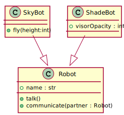
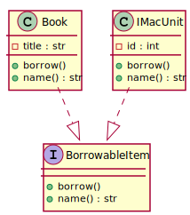

# OOPython

## Introduction

Python was never originally meant for pure oop. But OOP is not a classification, it is a paradigm. The language does not make the OOP elegant, it's how you adhere to the design principles of the paradigm.

## Learning Outcomes

1. Create python classes and objects/instances
2. Create `__init__()` methods
3. Establish realization relationships in python
4. Establish specialization relationships in python
5. Explain how different levels of visibility affects access and inheritance in python

---

## Python Classes

Creating classes in python is very easy, here's an empty class called `EmptyClass`:

> In python and other OOP languages, naming classes with nouns that start with capital letters is a convention. You can name it with weird names but correct naming is good practice for maintainability.

```python
class EmptyClass:
    pass
```

You write `pass` to indicate that this specific scope is empty. By putting `pass` inside classes the classes will have no attributes or methods, thus an empty class.

To make this class more interesting, lets put something inside it. You can put methods and attributes inside classes. Everything found inside the indent level of a class, belongs to that class.

```python
from abc import ABC, abstractmethod

class EmptyClass:
    pass

class VoiceBox:
    name : str = "Vincent"
    def speak():
        print("Hi, I'm " + VoiceBox.name + " the VoiceBox")

VoiceBox.speak()
VoiceBox.name = "Vito"
VoiceBox.speak()
```

```
Hi, I'm Vincent the VoiceBox
Hi, I'm Vito the VoiceBox
```

When the `VoiceBox.speak()` is called, the method `speak()` found inside the scope of `VoiceBox` is called. This function accesses an a identifier called `VoiceBox.name` which refers to the identifier `name` found inside `VoiceBox`. As, you can see, classes in python uses dot-reference similar to C.

When `VoiceBox.name = "Vito"` is executed, it changes the assigned value to "Vito (which was originally "Vincent"). Now when `VoiceBox.speak()` is invoked again, it says "Hi, I'm Vito the VoiceBox".

This usage of classes is not actually interesting at all. Even though it contains attributes and methods, this class is merely used like a data holder. The attributes and methods you see inside `VoiceBox` right now are what we call **static** attributes and **static** methods. We won't really use a lot of static attributes and methods in this course (it's not good practice to use them). Basically, statics are attributes and methods that are not associated to class instances. They exist in the class itself, outside the lifetime of any instance. 

Right now, the `VoiceBox` class is unable to create meaningful instances or objects. To do that we need to implement a constructor. Let's make a new class, one that can construct meaningful instances of itself.

## `__init__()` Constructor

The `__init__()` method is a special method that is responsible for spawning instances of the class. This method stands for **initialization**. Here it is in action.

> `__init__` is surrounded by two underscores on each side.

```python
class Robot:
    def __init__(self, n : str):
        self.name = n

    def talk(self):
        print("Howdy, it's me, "+ self.name)

    def communicate(self, partner : 'Robot'):
        print("Howdy, "+ partner.name + " it's me, "+ self.name )

r1 : Robot = Robot("Bonk")
r2 : Robot = Robot("Chonk")

r1.talk()
r2.talk()

r1.name = "Donk"

r2.communicate(r1)
```

```
Howdy, it's me, Bonk
Howdy, it's me, Chonk
Howdy, Donk it's me, Chonk
```

Lets look at this code piece by piece. First the `__init__()` method

```python
#Robot
def __init__(self, n : str):
	self.name = n
```

Here you'll notice a special identifier called `self`.  The identifier `self` is a special reference to the instance of the class using this. Basically whichever instance is being spawned right now is assigned to `self`. It doesn't actually have to be named `self` you can name it anything (but naming it `self` is a python convention). Python understands that the first identifier found at any non-static method is a reference to the instance invoking the method. 

Inside, we are preparing the instance by assigning values to its attributes. We do that by assigning `n`, a string type parameter passed to `__init__()`, to `self.name`. Since name is dot referenced to `self`, which is the instance being spawned, the instance gains the `name` attribute. Unlike, `VoiceBox.name`, this attribute is associated to an instance of `Robot` not the class `Robot` itself.

There's also something not explicitly shown here that python automatically does. The method `__init__()` returns `self`, the instance being spawned at the by `__init__()`.

To use the `__init__()` function, we create two instances of `Robot` using the following code:

```python
#outside Robot
r1 : Robot = Robot("Bonk")
r2 : Robot = Robot("Chonk")
```

The identifier `r1` is assigned a new instance of `Robot` named "Bonk", and the identifier `r2` is assigned a new instance of `Robot` named "Chonk". 

The expression `Robot("Bonk")` is equivalent to the invoking the `__init__()` function, while passing the string "Bonk" to be assigned to the parameter `n`. Notice how `__init__()` expects two parameters but its invocation `Robot("Bonk")` only provides two, that is because the instance assigned to `self` is automatically passed without being explicitly shown (take note of this because a lot of people forget about the hidden `self`, including me from time to time).

```python
#outside Robot
r1.talk()
r2.talk()
```

```
Howdy, it's me, Bonk
Howdy, it's me, Chonk
```

Since there are two separate instances of `Robot` with different names, it prints two different lines. This happens because inside of what we wrote inside the method `talk()`

```python
#outside Robot
def talk(self):
	print("Howdy, it's me, "+ self.name)
```

Notice how `talk()` uses the special reference `self` again. `self` which is the first and only parameter passed, is used by concatenating `self.name` to the printed message. Since `self` refers to the instance invoking talk, the instance's own name is used ("Bonk" for `r1` and "Chonk" for `r2`).

Also, notice how when invoked, nothing is passed to `talk()`, despite expecting one parameter. This is again because the instance invoking, is automatically passed and assigned to `self` behind the scenes.

> When you're writing a non-static method, always include `self`. Even if you do not use the reference to `self` inside the function. That's because python will force the first parameter in the method to accept the instance reference.

Let's look at the next lines of code.

 ```python
#outside Robot

r1.name = "Donk"

r2.communicate(r1)
 ```

````
Howdy, Donk it's me, Chonk
````

First, the name of the instance assigned to `r1` is changed from "Bonk" to "Donk". Then, `r2` invokes its method `communicate()` passing the instance `r1`. Let's look at the insides of `communicate()`.

```python
#inside Robot
def communicate(self, partner : 'Robot'):
	print("Howdy, "+ partner.name + " it's me, "+ self.name )
```

The instance assigned to `r1` is passed and assigned to `Robot`. The instance `r2` is also passed and assigned to `self` but behind the scenes. Inside this method both `partner.name` and `self.name` are used. `partner` refers to the instance named "Donk" and `self` refers to the invoker of the method, the one named "Chonk". As, a resilt of all these, the line "Howdy, Donk it's me, Chonk" is printed.

> If you notice the type annotation `Robot` is surrounded by single quotes. If you remove these quotes, python will spill an error because it doesn't recognize an `Robot` as a class name yet. That's because the `communicate()` function is inside `Robot`, therefore Robot hasn't been defined yet.

## Python Realizations and Specializations

### Specialization

The syntax for establishing realization and specialization relationships are the same in python. It just depends if the classes involved are abstractions or generalizations.

Here's a generalization relationship in action.

```python
class SkyBot(Robot):
    def fly(self, height:int):
        print("I'm "+ str(height) +"m high in the air. Skybot go zoom. ")

r3:SkyBot = SkyBot("Zonk")
r3.talk()
r3.fly(3)
```

```
Howdy, it's me, Zonk
I'm 3m high in the air. Skybot go zoom.
```

> Note how even though, `self` is unused inside the method `fly()`, `self` is written in the parameter list. If you do not do that, the python will assign the invoking instance to `height`.

> Since `height` is `int` you need to convert it using the `str()` function so that concatenation is allowed.

The class `SkyBot` becomes a specialization of `Robot` through the line, `class SkyBot(Robot):`. The class name between the parentheses will be specialized by the class outside the parentheses.



Notice how even though the functions `__init__()`, `talk()`, and `communicate()` are not in found in the scope of `SkyBot`, you are still able to use them. That is because `SkyBot` has inherited them.

> If class relationships haven't been discussed yet. Don't worry we will talk about them in a future lecture. For this lecture focus on python syntax.

Here's an example that shows how to extend the attributes of a generalization

```python
class ShadeBot(Robot):
    def __init__(self, n:str, o:float):
        Robot.__init__(self,n)
        self.visorOpacity = o

    def communicate(self,partner:Robot):
        if self.visorOpacity >= 1:
            print("Howdy, it's me, "+ self.name + ". Sorry I cant see you my shades are too dark")
        else:
            print("Howdy, "+ partner.name + " it's me, "+ self.name)

r4:ShadeBot = ShadeBot("Tonk", 1)
r4.talk()
r4.communicate(r3)
```

```
Howdy, it's me, Tonk
Howdy, it's me, Tonk. Sorry I cant see you my shades are too dark
```

Here, even though `ShadeBot` inherits `__init__` from `Robot`, it has its own definition of `__init__`. When this is done, `ShadeBot` replaces `Robot`'s version of `__init__` with its own. This is called **method overriding**. You will need to do this for `__init__` if you need to extend the class to have more attributes (You also override methods if you need something changed for the specializations). We are doing this for `ShadeBot` since we need to add the attribute `visorOpacity`.

You'll notice the strange line of code, `Robot.__init__(self,n)` inside `Shadebot`'s `__init__`. What you're doing here is statically invoking `Robot`'s `__init__` function to reuse the code inside it (statically invoking means that the class itself is invoking the method not any instance, that's why `self` is being explicitly passed). Calling this is similar to doing the following

```python
#ShadeBot
def __init__(self, n:str, o:float):
    self.name = n
    self.visorOpacity = o
```

If you're not changing anything that happens during the `__init__` of the specialization just extending it, then you can statically invoke the generalization's `__init__`. Otherwise, if you need to change how the specialization gets its name for example, then you have to fully write the whole specialization's `__init__`.

```python
#ShadeBot
def __init__(self, n:str, o:float):
    self.name = "Mr." + n
    self.visorOpacity = o
```

## Realization

The syntax for realization is just the same as specialization. If you put an abstraction inside the parentheses then the relationship becomes realization.

```python
from abc import ABC, abstractmethod

class BorrowableItem(ABC):
    @abstractmethod
    def borrow(self):
        pass

    @abstractmethod
    def name(self) -> str:
        pass

class Book(BorrowableItem):
    def __init__(self, title:str):
        self.title = title

    def borrow(self):
        print("I'm a book called "+ self.name() +" and I'm being borrowed")

    def name(self) -> str:
        return self.title

class IMacUnit(BorrowableItem):
    def __init__(self, id:int):
        self.id = id

    def borrow(self):
        print("I'm an iMac called "+ self.name() +" and I'm being borrowed")

    def name(self) -> str:
        return "iMac" + str(self.id)


b : BorrowableItem = Book("Necronomicon")
i : BorrowableItem = IMacUnit(5)

b.borrow()
i.borrow()
```

```
I'm a book called Necronomicon and I'm being borrowed
I'm an iMac called iMac5 and I'm being borrowed
```

First things first, to be able to make use of abstractions, you need to import the `abc` library. We specifically need 2 things, the class `ABC` which stands for **abstract base class** and the decorator `abstractmethod`. You typically put import lines at the top of your code, above everything else. 



The abstraction in this case is the class called `BorrowableItem`. For a class to become an abstraction it needs to realize the imported class `ABC`, hence the line `class BorrowableItem(ABC):`.

Inside `BorrowableItem` are two methods called `borrow()` and `name()`. Both of these methods are decorated by `@abstracmethod`. You see this decoration above all methods that you want to be abstracted. Inside each of `borrow()` and `name()` is the special expression `pass`. Which means that these methods are empty. They do not contain any implementation or body. You can put code inside these methods but it wouldn't matter since these methods will be guaranteed to be overwritten by `BorrowableItem`'s realizations.

What `@abstractmethod` does is, it indicate to python that the directly method below it, must be overridden by the abstraction's realizations. You'll notice this if you change the code above by adding another method decorated with `@abstractmethod` without implementing it inside all the realizations, you'll get the following error during instantiation:

```python
#BorrowableItem
@abstractmethod
def implementationRequirement(self):
	pass
```

```
Traceback (most recent call last):
  File ".\OOPython.py", line 95, in <module>
    b : BorrowableItem = Book("Necronomicon")
TypeError: Can't instantiate abstract class Book with abstract methods implementationRequirement
```

Without `@abstractmethod` python will not complain

```python
#BorrowableItem
def implementationRequirement(self):
	pass
```

```
I'm a book called Necronomicon and I'm being borrowed
I'm an iMac called iMac5 and I'm being borrowed
```

The decorator `@abstractmethod`  reminds all realizations of the requirements to remind any class that realizes the abstraction, "hey these are the functions that you need to be considered a `BorrowableItem`".

Moving on to the realizations, you see is that each realization overrides all abstract methods. You can also put methods that are not found in the abstraction. Here, you see both of them contain an `__init__()` method for instantiation. 

> Note on the code inside `Book`'s `__init__()`': although the parameter is called `title` and the attribute is called `title` as well, python can differentiate between them since the instance's title has to be dot referenced as `self.title` while the non-dot referenced `title` can only mean the parameter. It's fine to this, especially if you want to emphasize which parameters are stored to which attributes. In fact, I do this quite a lot. 

> Note how the abstraction `BorrowableItem` does not contain an `__init__()` method. This is because he `BorrowableItem` is not meant to be spawned/instantiated. It is merely an abstraction so it must be ethereal and formless.

Outside the class scopes you'll see these borrowable items instantiated like these:

```python
b : BorrowableItem = Book("Necronomicon")
i : BorrowableItem = IMacUnit(5)
```

Both `b` and `i` are annotated to be of type `BorrowableItem` but they are instantiated from `Book` and `IMacUnit`. This is allowed because of polymorphism. Through realization, instances of `Book` and `IMacUnit` can be treated as `BorrowableItem`'s (they can also be treated specifically as `Book` and `IMacUnit`).

## Python Visibility Control

Another important python syntax to remember is how to simulate different visibility levels for methods and attributes. Given the following class below, notice how the attributes and methods have special prefixes. These prefixes tell you that their visibility level.

```python
class ClandestineClass:
    def __init__(self, publicValue:int, protectedValue:int, privateValue:int):
        self.publicValue = publicValue
        self._protectedValue = protectedValue
        self.__privateValue = privateValue


    def doPublicly(self):
        print("Hey!, these are my values")
        print(self.publicValue)
        print(self._protectedValue)
        print(self.__privateValue)

    def _doProtectedly(self):
        print("hey")

    def __doPrivately(self):
        print("...")
```

When the following code is ran, you'll notice that private, attributes and methods are not recognized by python:

```python
#outside ClandestineClass
print(c.publicValue)
print(c._protectedValue)
print(c.__privateValue)
```

```
1
2
Traceback (most recent call last):
  File ".\OOPython.py", line 122, in <module>
    print(c.__privateValue)
```

In other oop based languages, protected values are not supposed to be accessible outside the class. But python doesn't have this mechanism. What python programmers do instead is to write protected identifiers with a single underscore prefix. Yes you can access them but you are not supposed to.

Of course all of these attributes can be accessed **inside** the class:

```python
c.doPublicly()
```

```
Hey!, these are my values
1
2
3
```

Specializations do not have access to the private attributes and methods of its generalizations. . But both public and protected are. If you want some attributes/methods to be inherited but still (sort-of) inaccessible outside, make them protected instead.

```python
class SpecialClandestineClass(ClandestineClass):
    def doSomethingSpecial(self):
        print(self.publicValue)
        print(self._protectedValue)
        print(self.__privateValue)

s:SpecialClandestineClass = SpecialClandestineClass(1,2,3)
    
s.doPublicly()
print() #prints a new line for formatting
s.doSomethingSpecial()

```

```
Hey!, these are my values
1
2
3

1
2
Traceback (most recent call last):
  File ".\OOPython.py", line 133, in <module>
    s.doSomethingSpecial()
  File ".\OOPython.py", line 123, in doSomethingSpecial
    print(self.__privateValue)
AttributeError: 'SpecialClandestineClass' object has no attribute '_SpecialClandestineClass__privateValue'
```

Note how `s.doPublicly()` still works perfectly because its definition lies inside `ClandestineClass`. On the other hand, `s.doSomethingSpecial()` will fail in printing private values since it is outside `ClandestineClass`.

Here's a summary of the access rules.

| visibility | prefix                   | accessed specializations | accessed by clients                                    |
| ---------- | ------------------------ | ------------------------ | ------------------------------------------------------ |
| public     | (none)                   | yes                      | yes                                                    |
| protected  | `_` (single underscore)  | yes                      | technically yes in python (but you're not supposed to) |
| private    | `__` (double underscore) | no                       | no                                                     |

> Private values in python can actually be accessed outside using a special syntax. But it is out of scope here and you're not supposed to this anyway so don't worry about it.

## Abstract Classes

Abstract classes in python are implemented similar to how Abstractions are implemented. All methods that you want to be implemented are decorated by `@abstractmethod` while all methods you want to be inherited are not decorated.

```python
class AbstractClass(ABC):
    @abstractmethod
    def printSomethingA(self):
        pass

    def printSomethingB(self):
        print("I'm inherited. You can also override me if you want")

class ConcreteClass1(AbstractClass):
    def printSomethingA(self):
        print("I'm implemented by Concrete Class 1")

class ConcreteClass2(AbstractClass):
    def printSomethingA(self):
        print("I'm implemented by Concrete Class 2")

    def printSomethingB(self):
        print("I'm overriden by Concrete Class 2")
```

Both `ConcreteClass1` and `ConcreteClass2` are realizations/specializations of `AbstractClass` therefore they must implement `printSomethingA()` otherwise it will cause an error (because of the `@abstractmethod` decoration). The other method `printSomethingB()` will automatically be inherited by both, but can still be optionally overridden (`ConcreteClass2` does this). 

```python
#outside the classes
c1.printSomethingA()
c1.printSomethingB()
print()
c2.printSomethingA()
c2.printSomethingB()
```

```
I'm implemented by Concrete Class 1
I'm inherited. You can also override me if you want

I'm implemented by Concrete Class 2
I'm overriden by Concrete Class 2
```

