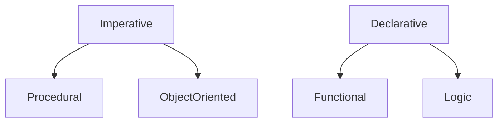

---
header-includes:
 - \usepackage{fvextra}
 - \DefineVerbatimEnvironment{Highlighting}{Verbatim}{breaklines,commandchars=\\\{\}}
---

# Programming Paradigms Introduction

## Introduction

I've probably talked about my issue about the title of this course. You see, it's a misnomer, it's not named correctly. Most of this course will actually focus on objective oriented programing, you can see it in the syllabus. That being the case, it should have been named object oriented programming instead. But we ARE going to spend some weeks to talk about programming paradigms at the start of this course.

## Learning Outcomes

At the end of this discussion you should be able to:

1. Explain what a programming paradigm is.
2. Identify the four main programming paradigms
3. Explain why programming languages are shifting to multi-paradigmness

---

## The title of this course

Let's start by talking about the notorious title of the course name because it does sound like some forced alliteration buzz phrase that you'll probably hear out of the mouth of some CS student. You will start saying this phrase soon so let's get the definition out of the way. 

"Programming paradigms". 

You're probably familiar what half of this phrase means, I mean, I hope you are, otherwise I don't know what to do. 

## Paradigm

Let's focus first on the non-obvious part, the word paradigm. This word comes up often in academia. You probably heard of the term paradigm shift some where, it describes some form of fundamental change in the way we think within scientific disciplines often characterizing a scientific revolution, one notable example of a paradigm is the shift from Ptolemaic or Geocentric cosmology to Copernican or Heliocentric cosmology. Based on this context you can kind of formulate what the word paradigm means. You don't have to take out your dictionaries or whatever, because I'm going to read to you a dictionary definition I found. This one is connotes a similar meaning in the context of programming:

A paradigm is "a worldview underlying the theories and methodology of a particular subject" [^1]. It is a set of ideas and concepts that describe some way of thinking.

If we go back to the geocentric vs heliocentric paradigms in astronomy, you can't really definitively say that the heliocentric model is the only correct model of the solar system, you can still reconcile the geocentric model's perspective of putting the earth in the center by imagining heavenly bodies with strange orbits containing epicycles and other mechanics. After all whether or not the earth or the sun is the center is a matter of perspective. It just so happens that placing the sun in the center provided science with a more natural way of describing planetary movement. The heliocentric paradigm ended up uprooting geocentric paradigm as the dominant worldview, providing science with ideas that we still accept as truth until now, the earth is not the center. The earth is just one of the 9 planets, is not that special, gravity and inertia works in way which causes planets to move and etc.

A paradigm shift like this is actually happening in programming language design, well talk about that some time later.

## Programming

Now that you understand what paradigm means, let's talk about the first word, programming. It's a strange question to ask in a second year course but I want you all to think about what the definition of programming is. The way you answer this question may actually tell you which perspective or programming PARADIGM you follow. When you say you are "programming" some kind of mechanism or behavior what are you actually doing? How do you define what a program is and what is its relationship to a computer?

I would have loved to hear your answers on this but since we cant do that. I'll tell you instead to seriously think about that question before I proceed. 

Since I don't know how you responded to that I'll instead turn to the internet and look for an answer that probably looks like your answer. 

Here's one: 

"Computer programming is the process that professionals use to write code that instructs how a computer, application or software program performs. At its most basic, computer programming is a set of instructions to facilitate specific actions.[^2]"

That is correct. Let me simplify that definition to this. 

Programming is when you tell a computer what to do. When you write programs you're writing instructions for your computer.

Step 1. Ask the user for a number

Step 2. Store that number to a variable called x.

Step 3. While x is greater than 7 do step 4 otherwise proceed

Step 4. Subtract 7 to x and store the difference to x

Step 5. Show the user the value of x

That is a good definition of programming. It gives you an understanding on how you write programs that work. All you need to do is to write correct instructions that the computer understands and you'll have a perfectly working program. A programming language is a medium that describes how to write instructions to communicate to your computer. If you learn to do that then you can go ahead and program away.

It is a correct definition, but is it the only correct definition? It defines programming under the paradigm imperative programming. I will not begrudge you if this is the only definition you know since there is a huge likelihood that the only paradigm you've been exposed to has been imperative programming. 

## Taxonomy of Programming Paradigms

For someone who has been exposed to C, C++ and nothing else, you might feel that the natural way to code is the *imperative way* when in fact there are alternatives.

The diagram[^3] here represents the alternative schools of thoughts describing how to program. This diagram taxonomizes programming languages by identifying which paradigms they are under. Most of these paradigms are either not pragmatic, not popular enough or not unique enough to be studied in this course. Instead we will be focusing on four major programming paradigms:

Under the imperative family, procedural programming and objective oriented programming.

Under the declarative family, functional programming and logic programming.

This course will give you an overview on these programming paradigms. Each of these are built upon the foundation of some mathematical formalism. We will explore the advantages and disadvantages of each paradigm while we take a tour through these four. Studying the disciplines upheld by these paradigms will also teach us good programming practices for designing elegant programs that transcends any programming paradigm.

## Multi-paradigm programming languages

The way it used to be was that a programming language would be written with features adhering to the concepts of a particular paradigm. Sometimes, a language is written with fresh features that follow a different mathematical formalism that births its own programming paradigm. Back then paradigms worked like programming language classifications. The programming language C for example is a strong follower of procedural programming. Therefore, you can think of C as classified under procedural programming.

But as time passed by classifying a newer programming language under one paradigm became harder and harder. A programming language like python for example is mostly procedural, object-oriented, but sometimes functional. 

Modern programming languages evolved to become multi-paradigm. This inevitably happened because, as programming languages age and grow, more features are added to it. These features are sometimes borrowed from other paradigms to solve a problem in a better way. This is the reason why established and mainstream programming languages like Java, C++, or Python tend to be multi-paradigm.

The multi-paradigmness of programming languages tend to be the reason why some programming language designers have abandoned the notion of building based on a strict paradigm. Instead a language designer would choose specific **features** that they want to be supported on their programming language and implement it, regardless of its paradigm origins. 

[^1]: In Lexico.com, Available at [https://www.lexico.com/en/definition/paradigm ](https://www.lexico.com/en/definition/paradigm Accessed August 28)Accessed August 28, 2020
[^2]: What is Computer Programming and How to Become a Computer Programmer, SNHU from https://www.snhu.edu/about-us/newsroom/2018/06/what-is-computer-programming Accessed August 28, 2020
[^3]: Programming Paradigms according to VanRoy by [MovGP0](https://commons.wikimedia.org/wiki/User:MovGP0) used under [CC BY-SA](https://creativecommons.org/licenses/by-sa/4.0/) from https://en.wikipedia.org/wiki/Programming_paradigm#/media/File:Programming_paradigms.svg

## Optional Readings

Van Roy, Peter. (2012). [Programming Paradigms for Dummies](https://www.researchgate.net/publication/241111987_Programming_Paradigms_for_Dummies_What_Every_Programmer_Should_Know): What Every Programmer Should Know. 

