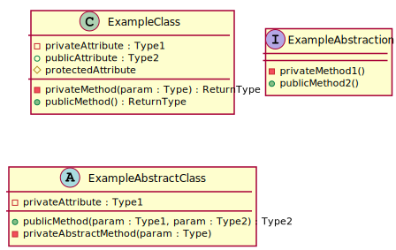
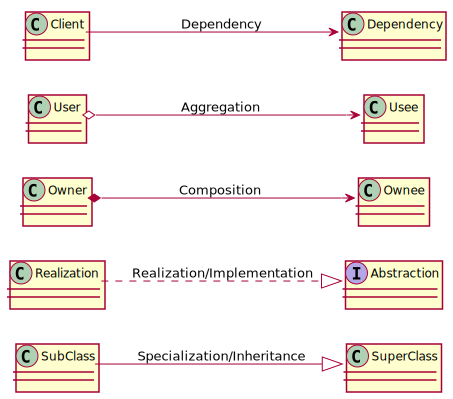

# Unified Modelling Language for Class Diagrams

## Introduction

The modelling language we are going to use to represent architecture would be UML or **Unified Modelling Language**. We use this to show the relevant classes in the system including their attributes, methods and relationships with other classes. UML differ a little depending on the source. The syntax we'll be following in this class would be based on PlantUML.

## Learning Outcomes

1. Create class diagrams to represent OOP architecture in UML
   1. Create classes with attributes and methods in UML
   2. Establish class relationships in UML

---

## Modelling Classes

The example below shows three classes. One is concrete class called `ExampleClass` (notice the "C" in the title that denotes it is a concrete class). Another is an abstraction called `ExampleAbstraction` (denoted by "I" which stands for interface). The last one is `ExampleAbstractClass` which is an abstract class (denoted by "A"). 

Attributes are placed in the top portion and methods are placed in the bottom portion. The shape to the left of each attribute or method indicates its visibility. Filled shapes indicate visibilities for methods while unfilled shapes indicate visibilities for attributes.

> When writing UML for python code, I usually omit writing the `self` special identifier inside method specifications. It is implied that `self` is passed always for all non-static methods in python. 

|            attribute            |              method              | visibility |
| :-----------------------------: | :------------------------------: | :--------: |
|    |    |  private   |
|  |  | protected  |
|     |     |   public   |

The names for abstract methods, abstractions, and abstract classes are italicized.

If possible, write the expected type of attributes, parameters and function returns. This is written on the right side of their names, to the right of ":".

> **Disclaimer**: sometimes you'll find some mistakes in my uml diagrams, sometimes I write the incorrect visibility marker or neglect abstract italicizations. Rest assured the code will contain the correct visibility markers, abstract modifiers and etc.

## Modelling Class Relationships

Here's a reference arrows that indicate the relationship between two classes:

> Sometimes, instead of writing the specific kind of dependency arrow (aggregation or composition), I just write the general dependency arrow instead

## Optional Readings

PlantUML Class Diagrams. https://plantuml.com/class-diagram Accessed August 31, 2020