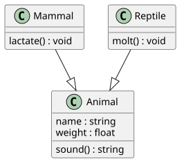
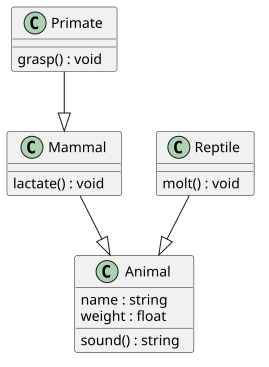

# Fundamental Concepts of OOP

## Encapsulation

One of the most important design principle of object-oriented programming is the concept called encapsulation.
I've said it again and again, and I don't mind saying it again right now, oop's innovation that made the paradigm a solution to the issues of state is its mechanism to construct boundaries wherever you want (you should want to put it between irrelevant data).
This mechanism is also called **encapsulation**.
Here are a few important points to remember:

- Encapsulation, when done correctly, makes your system approach a more accurate simulation of the real world.
The more you encapsulate related data and methods, the more you'll create cohesive classes that have definite and indivisible purpose.
- You should **encapsulate what varies**, meaning, things that always change should be encapsulated deep into the structure of your code.
This will help with maintainability since the changing isolated data or behavior will have less impact to the whole system.
- Encapsulation means both attributes and behaviors.
Concrete objects should be given the responsibility of implementing their own behavior.
This means that a method that describes the behavior of a certain class should belong to that class.

Which implementation is better?

**Tax rate as a global variable**

```python
TAX_RATE = 1.1

product1_price = 100
product2_price = 35
exempt_product_price = 22 #exempted from tax

final_price += product1_price * TAX_RATE
final_price += product2_price * TAX_RATE
final_price += exempt_product_price
```

**Tax rate hard coded for every instance of use**

```python
product1_price = 100
product2_price = 35
exempt_product_price = 22 #exempted from tax

final_price += product1_price * 1.1
final_price += product2_price * 1.1
final_price += exempt_product_price
```

**A function called `taxedPrice()` which calculates tax**

```python
TAX_RATE = 1.1

def taxedPrice(price):
	return price * TAX_RATE

product1_price = 100
product2_price = 35
exempt_product_price = 22 #exempted from tax

final_price += taxedPrice(product1_price)
final_price += taxedPrice(product2_price)
final_price += exempt_product_price
```

Hardcoding tax calculation for every instance is the least encapsulated solution.
This solution is the least future-proof version since changes in tax rate will require changing every instance of tax calculation manually as well.
To improve upon this we can encapsulate tax rate into a global variable.
Anytime there are changes to the tax rate, we simply change the value of `TAX_RATE` and all tax calculations will be updated as well.

This can be improved even more by encapsulating the tax calculation deeper into its own helper function.
This version makes it more resilient to tax policy changes.
Maybe in the future, tax calculation becomes more complex than simple multiplication.
If this does happen our code is ready to accept the change by simply changing the body of `taxedPrice()`.

As seen here, we see how tax calculation is something that has potential to change.
It is volatile.
As mentioned earlier, it is prudent to encapsulate volatile code to make it easier to update.

## Inheritance 

Another important design principle in OOP is the concept of **inheritance**.
Inheritance is the concept in which the definition of a class is derived from another class.
An existing class, called the **super class** (also called the **base class** or the **parent class**) passes all visible attributes and methods to a **subclass** (also called the **derived class** or the **child class**).


The concept of inheritance is also a representation of the real world.
You use inheritance to represent generalizations and specializations.
A super class is a generalization of a subclass and a subclass is a specialization of a super class.

In this example the supertype animal is a generaliztion of the subtype mammal.
Although it isn't shown, `Mammal` will also have the attributes `name` and `weight` and the method `sound()` since it inherits these from the parent class.
Mammal has a method of its own called `lactate()` which it doesn't share with animal.



A subclass can also be a super class for another class.
This is used to represent specializations of specializations.



The class primates will then inherit all visible attributes and mehtods of `Mammal` which include those that are inherited from `Animal`.


Some programming languages will allow you to add restrictions to the inheritance of an attribute or a method.
Languages like `C++` or `Java` does this using the modifiers `private` and `protected`

| super class visibility | public derivation | protected derivation | private derivation |
| ---------------------- | ----------------- | -------------------- | ------------------ |
| `public`               | `public`          | `protected`          | `private`          |
| `protected`            | `protected`       | `protected`          | `private`          |
| `private`              | *not inherited*   | *not inherited*      | *not inherited*    |

## Polymorphism

Polymorphism literally means *multiple forms*.
One of the core philosophy of OOP allows object instances to exist in multiple forms.
What this means code-wise is that the types of object instances can be decided during runtime.

### Compile-time polymorphism

There’s also another type of polymorphism that is not necessarily shared by all OOP languages, compile-time polymorphism.
This is basically the feature where multiple functions can have the same name as long as they have different parameter type signatures.
We also call this feature as method overloading or dynamic dispatch.

###  Run-time polymorphism

Run-time polymorphism on the other hand, is basically achieved using specialization and realization relationships between objects.
This is usually what Polymorphism refers to in the scope of OOP.

For example, An object instantiated to be of type `Primate` is also an instance of `Animal` because a primate is just a specialization of an animal.
This is a reflection of how the real world works because a primate is indeed an animal.
On realization relationships like a `Book` and a `BorrowableItem`, the same is also true, because a book is also something that can be borrowed.
Realization and specialization relationships guarantee that you can interact with a subtype as its super type, and you can interact with concrete class as its abstraction.
