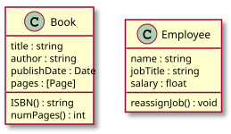
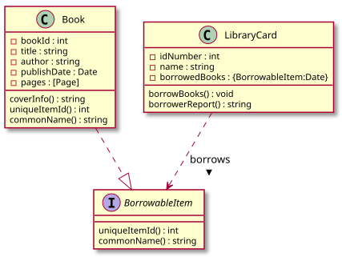
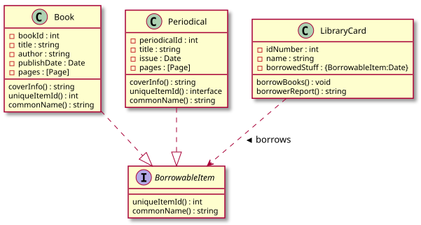

# Object-Oriented Programming Paradigm

## Introduction

As procedural programming became more and more mainstream, computer scientists started to notice the issues behind states and side effects.
Some languages offered a complete paradigm shift, completely abandoning the notion of state.
This exodus formed the alternative paradigm family, declarative paradigm.
Other languages however, went on a different direction.
These languages offered a solution to fixing state by introducing richer features and an intuitive design.
From this approach the paradigm object-oriented programming was born.

## Learning Outcomes

After this discussion you should be able to

1. Explain how programmers started to focus on writing maintainable code
2. Differentiate between the object and the class
3. Explain OOP's philosophy, the surface vs. the volume
4. Explain what abstraction means
5. Describe the fundamental concepts: encapsulation, inheritance, and polymorphism

---

As time went by and as technology evolved, computer scientists noticed new issues on the code they were writing.
The goal of building the most optimized machine code became less and less of a priority.
Programmers had, under their disposal, faster and better hardware.
As the demand for complex systems grew, the priority shifted from *code that run*s, to *code that was intuitive*.
As programmers started to build bigger and bigger systems, they started to notice the issues in terms of maintainability.


This shift in focus can be seen from the extremes of procedural paradigm such as the programming language Assembly.
Assembly code was not really built to be intuitive.
It was built to reliably work.
Assembly contained mechanisms to move data around and to control program flow.
These features were enough for that time since the objective of programming was to write efficient code that bulky slow CPUs understand.
Assembly programmers did not have time to worry about code elegance or intuitiveness.

The landscape started to change when hardware started becoming better and software started becoming more complex.
Speed and memory wasn't that much of an issue anymore, so computer scientists' focus shifted towards the issue of maintainability.
Software became bigger and more complex and understanding other programmers' code became more and more difficult.
In fact, understanding your own code was also becoming difficult.
Because of this writing code that a computer understands isn't enough anymore, a good programmer must write code that humans understand as well.
Code shifted from computer centered to human centered.

But instead of redesigning the concept of imperative paradigm to solve maintainability, object-oriented programming sought to build on top of the features of imperative programming.
State despite its known issues, still exists but OOP gave imperative programmers extra tools to protect code from being carelessly mutated.
Because of this OOP stayed under the imperative family since the programmer is still focused on telling the computer what to do using assignment statements and mutation.

## Fundamental Concepts of OOP

Object-oriented programming is usually defined using its four core design principles:

- Encapsulation
- Abstraction
- Inheritance
- Polymorphism

It is said that any programming language that contains these mechanisms is an object-oriented programming language.
But calling the entirety of a programming language, OOP can be problematic since you are free to write code written in an "OOP language" without actually using these design principles.
At the end of the day OOP is not merely a language classification, but a paradigm.
Some programming languages are indeed intentionally written to be used for OOP design, but these classifications are less important than judging if the code itself written by the programmer adheres to OOP's design principles.

### The Object

Let's start with the star and the building blocks of object-oriented programming.
What exactly is an object?

An object is a living organism in your code.
To grasp the capabilities and limitations of an object we will anthropomorphize objects.
Treating an object as an organism will guide you on how you use objects effectively.


Just like any creature an object has both form (attributes/fields) and behavior (methods) (this is one of the reasons why C's `struct` is not an object since `struct` instances only have form).
Objects are written to be representations of real world nouns such as a person or an employee or a file.
The best way to design objects is to simulate the real world form and behavior of what these objects represent.
Think of objects as the **representatives** of things in your code.
Since you cannot shove an actual employee in your system, you instead create a representative of that employee using an employee object.
If you start thinking about objects like representatives instead of mere data holders you'll be able to design a safe and elegant object.

### The Class

Often discussed alongside an object is the class.
There's usually a lot of confusion when identifying the difference between a class and an object, and it is probably because in the universe of your code, the class and the object will have the same name.


A class is the specifications for the creation of objects.
If you want to give a class a more proactive role, you can think of the class as the factory that builds objects.
There are a lot of analogies out there to illustrate the relationship of classes and objects.
For example, a star shaped cookie cutter (class) that makes star shaped cookies (objects).
If you want to make star shaped cookies you use the star shaped cookie cutters.
You can also call objects as instances of a class.
In fact that's what I call objects most of the time.
For example, the Cash class, `$2.75` is an instance of a Cash object.
Or a cat named Garfield is an instance of a class called Mammal.


If an object is a representation of a tangible real world object, then the class is the conceptual type/category of that real world object.

The following class diagrams are the representations of a book and an Employee.
The attributes of the book are `title`, `author`, `publishDate`, and `pages`.
These attributes also simulate the form of a real world book.
This object also has methods called `ISBN()` and `numPages()`.
The attributes of an employee are `name`, `string`, and `salary`, and it has a method called `reassignJob()`.



The following are representations of objects:

```
book1{
title: "Corpus Hermeticum"
author: "Hermes Trismegistus"
publishDate: Dec 12, 2008
pages: ......
}

book2{
title: "Behold a Pale Horse"
author: "Milton William Cooper"
publishDate: Dec 1, 1991
pages: ......
}

employee1{
name: "Rubelito Abella"
jobTitle: "Instructor 1"
salary: [REDACTED]
}
```

### The Surface and the Volume

#### Data Hiding and the Interface

Before we play around with some code, lets dive deep into the philosophy of object-oriented paradigm.
The base premise of OOP is the concept called **data hiding**.
And this formal OOP term describes what I mean when I say that, what OOP did for imperative programming was to allow the programmer to create artificial boundaries between irrelevant data and behavior.
In the eyes of an OOP design, procedural code is a mix of data and functions arbitrarily tossed in a spaghetti of mutations and side effects.

OOP's mechanism to create boundaries in the form of objects brought structure to imperative programming.
All the attributes of a `Book` object doesn't need to be accessed by the methods of a `LibraryCard` object.
That's because in the real world, a library card doesn't need to know what's written on page 69 of some book.
Some of the data in `Book` should be **hidden** from a client object `LibraryCard`.

Object-oriented programming's obsession to simulate real world objects is not caused by its dream to become an exact representation of the real world.
Object-oriented programming obsesses over structure and simulation because it is a necessity for human comprehension and therefore, maintainability.
Systems need good structure not because well-structured code is pleasant and elegant to look at, but because our feeble minds can't process poor structure efficiently.
In fact the reason why we call a well-structured piece code, "elegant" is because our tiny limited minds can process it well.

Trying to read this code would be comparable to looking at some Lovecraftian cosmic horror.
If such a code exists it'll probably contain the secrets of the universe.

The process of modeling elegant object representations is basically determining what the **public interface** of that object may be.
The interface of an object is the set of attributes and methods (methods are what we call functions that inside a class) that other objects can use to interact with it.
The attributes and methods that are not in the interface is essentially hidden information, inaccessible from the client objects.
For example, given a `Book` object that interacts with a `LibraryCard` object, the `LibraryCard` object's interface to interact with the book may only contain, `title` and `author`, because this is all the information it needs to properly do its job.
You can even hide those attributes and let the `LibraryCard` only interact with the `Book` using a `borrow()` method which lists the `Book` as borrowed in the library card.
 It doesn't need access to the attributes of the book to do this.
It interacts with the Book itself as a whole.




#### Abstraction of Objects

Creating interfaces like these provide OOP with the mechanism to create **abstractions**[^abstraction] in the object level.

[^abstraction]: The term abstraction is actually quite overloaded in OOP and CS in general. The "abstraction" I'm talking about in this context is the concept of abstract interface.

An abstraction in computer science is basically a model of computation that is free from its implementation.
 In the same way that functional programming creates abstractions of mathematical functions by writing lambdas without side effects, OOP creates abstractions of objects using interfaces that don't specify the exact implementation of an object.


In the example above, the interface `BorrowableItem` is an abstract representation of *something from the library that can be borrowed*.
An interface like `BorrowableItem` contains method names and type signatures, but it doesn't actually contain code.
That is because a `BorrowableItem` is an abstract representation.
We are not supposed to care about the implementation of the methods `uniqueItemId()` and `commonName()` all we should care about is that `uniqueItemId()` should return some `int` and `commonName()` should return a `string`.
 

The reason why this structure still works, is because we have a concrete class called `Book` which is a **realization** or an **implementation** of `BorrowableItem`.
A book is *something from the library that can be borrowed*.
Because a `Book` is a `BorrowableItem`, it must also behave based on the specifications of a `BorrowableItem`.
Meaning it must contain the methods `uniqueItemId()` and `commonName()` (which should also have the same type signature as the methods of `BorrowableItems`).
Since `Book` is a concrete class it's methods `uniqueItemId()` and `commonName()` should be implemented (meaning there should be code inside these methods).

Why even go through all this trouble? If *something from the library that can be borrowed* is an abstract idea, what is the point of modelling its representation? This looks like extra code just to represent something that doesn't really have an exact form in the real world.

For the current structure we created, this feels like extra code because our system is small enough right now.
But imagine if our system grows, and we need to incorporate other things from the library that are not books but can be borrowed.
For example, a library also contains periodicals that you can borrow as well, and these periodicals do not follow the form of the book.
You need a different representation for a periodical, therefore you need to create a new concrete class called `Periodical`.
Since a periodical is also *something from the library that can be borrowed*, a periodical is another **realization** of `BorrowableItem`.
And with the tiny effort of writing the implementation of a periodical (including the realized methods `uniqueItemId()` and `commonName()`), we added an extra interaction that allows a `LibraryCard` to borrow periodicals as well.



#### The Interface and the Implementation

Let's summarize what we learned so far by discussing how these capabilities characterize the philosophy of OOP.
The paradigm aims to solve the issues of state and maintainability by allowing programmers to create boundaries between its mix of attributes and methods.
The boundaries you enforce are basically the object structure you create.
A library card name shouldn't mix with a book title, so we put a boundary between them by **encapsulating** them into their respective objects.


You can imagine these objects as amorphous blobs with surface separating the methods and attributes inside it from other things in your code.
These amorphous blobs have volume and surface.
The volume of these blobs represent the **implementation** of these objects and the surface of these blobs represent the **interface** of these objects.
The interaction, between two objects is characterized by the surfaces of objects, the implementation.
The volume of the object shouldn't dictate how the objects relate to each other, in fact everything inside the object should be inaccessible to other objects.
Objects should only see each other's surface.
This means that the interaction between objects should be defined by their interface not their implementation.


Your job as an OOP programmer is to make sure that the complexity of the surface grows slower than the complexity of the core.
This means that as your system evolves, changes that happen in the core, the implementation hidden inside each object, (as much as possible) shouldn't affect the surface, the interfaces of each object.
This is what harmony and elegance in OOP means.
Objects interact with each other seamlessly, and intuitively, regardless of what their inside look like.

